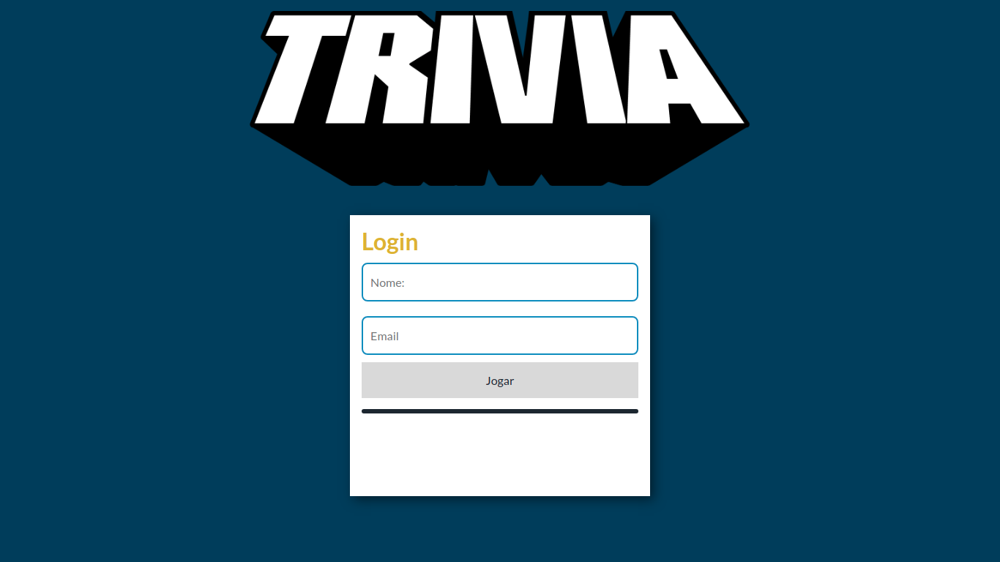

<h1 align="center">Trivia</h1>

Olá, seja bem vindo(a) ao projeto Trivia.  
Esse projeto foi desenvolvido em grupo durante o curso da Trybe no módulo de Front-end, utilizando
 <a href="https://pt-br.reactjs.org/"> React</a> e <a href="https://redux.js.org/"> Redux</a>. 

 
 

  <a href="#bookmark-sobre">Sobre</a>&nbsp;&nbsp;&nbsp;|&nbsp;&nbsp;&nbsp;
  <a href="#rocket-tecnologias">Tecnologias</a>&nbsp;&nbsp;&nbsp;|&nbsp;&nbsp;&nbsp;
  <a href="#hammer_and_wrench-features">Features</a>&nbsp;&nbsp;&nbsp;|&nbsp;&nbsp;&nbsp;
  <a href="#notebook-instalação">Instalação</a>&nbsp;&nbsp;&nbsp;|&nbsp;&nbsp;&nbsp;
  <a href="#eyes-demonstração">Demonstração</a>&nbsp;&nbsp;&nbsp;|&nbsp;&nbsp;&nbsp;
  <a href="#technologist-integrantes">Integrantes</a>&nbsp;&nbsp;&nbsp;|&nbsp;&nbsp;&nbsp;

<h4 align="center"> 
	🚧  Trivia 🚀 Em construção...  🚧
</h4>

<h2>:bookmark: Sobre</h2>

Este projeto é um jogo de perguntas e respostas baseado no jogo Trivia (tipo um show do milhão americano rs) utilizando React e Redux, desenvolvendo em grupo.

<h2>:rocket: Tecnologias</h2>
 
 As seguintes ferramentas foram usadas na construção do projeto:
 
 
-  [React](https://pt-br.reactjs.org/)
-  [Redux](https://redux.js.org/)

<h2>:hammer_and_wrench: Features</h2>

- [x] O usuário poderá logar no joga, e caso o email tiver cadastro no site Gravatar, ter sua foto associada ao perfil de usuária.
- [x] Acessar a página referente ao jogo, onde se deverá escolher uma das respostas disponíveis para cada uma das perguntas apresentadas.
- [x] A resposta deve ser marcada antes do contador de tempo chegar a zero, caso contrário a resposta deverá ser considerada errada.
- [x] Ser redirecionada, após 5 perguntas respondidas, para a tela de score, onde o texto mostrado depende do número de acertos.
- [x] Visualizar a página de ranking, se quiser, ao final de cada jogo.

<h2>:notebook: Instalação</h2>
<h3>Pré-requisitos</h3>

Antes de começar, você vai precisar ter instalado em sua máquina as seguintes ferramentas:
<a href="https://git-scm.com/">Git</a> e <a href="https://nodejs.org/en/">Node.js</a>.

<h2>:eyes: Demonstração</h2>
<h2>:technologist: Integrantes</h2>

<table>
  <tr>
   <td align="center"><a href="https://github.com/Zeonnatios">
     
      <b>Matheus Antonio</b></a> <a href="https://github.com/Zeonnatios" title="GitHub Matheus Antonio">🚀</a>
   </td>
   
   <td align="center"><a href="https://github.com/LeoFuna">
     
      <b>Leonardo Funabashi</b></a> <a href="https://github.com/LeoFuna" title="GitHub Leonardo Funabashi">🚀</a>
   </td>
   
   <td align="center"><a href="https://github.com/heyynat">
     
      <b>Natali Lima</b></a> <a href="https://github.com/heyynat" title="GitHub Natali Lima">🚀</a>
   </td>
  
  </tr>
</table>
